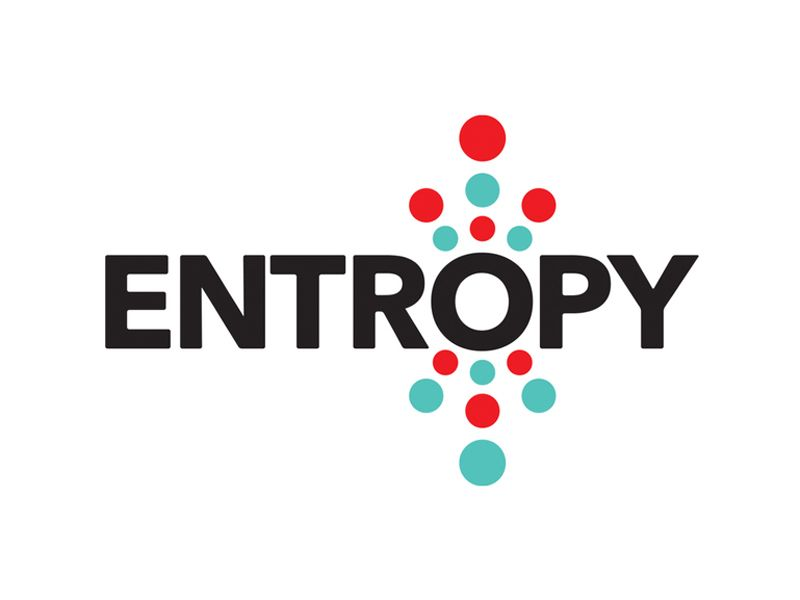

<a name="readme-top"></a>

[![Contributors][contributors-shield]][contributors-url]
[![Forks][forks-shield]][forks-url]
[![Stargazers][stars-shield]][stars-url]
[![Issues][issues-shield]][issues-url]
[![MIT License][license-shield]][license-url]

[![LinkedIn][linkedin-shield]][sadeq-linkedin-url]

<!-- PROJECT LOGO -->
<br />
<div align="center">
  <a href="https://github.com/msadeqsirjani/eeg-based-epilepsy-detection">
    
  </a>
  <a href="https://github.com/msadeqsirjani/eeg-based-epilepsy-detection">
    
  </a>
  <a href="https://github.com/msadeqsirjani/eeg-based-epilepsy-detection">
    
  </a>
    <a href="https://github.com/msadeqsirjani/eeg-based-epilepsy-detection">
    
  </a>
  <p align="center">
    Hey !!
    <br />
    In this repository, we are going to realize some epilepsy patients based on the datasets.
    <br />
    <a href="https://github.com/msadeqsirjani/eeg-based-epilepsy-detection"><strong>Explore the docs »</strong></a>
    <br />
    <br />
    <a href="https://github.com/msadeqsirjani/eeg-based-epilepsy-detection/issues">Report Bug</a>
    ·
    <a href="https://github.com/msadeqsirjani/eeg-based-epilepsy-detection/issues">Request Feature</a>
  </p>
</div>

<!-- TABLE OF CONTENTS -->
<details>
  <summary>Table of Contents</summary>
  <ol>
    <li>
      <a href="#about-the-Repository">About The Repository</a>
      <ul>
        <li><a href="#built-with">Built With</a></li>
      </ul>
    </li>
    <li>
      <a href="#getting-started">Getting Started</a>
      <ul>
        <li><a href="#prerequisites">Prerequisites</a></li>
        <li><a href="#installation">Installation</a></li>
      </ul>
    </li>
    <li><a href="#usage">Usage</a></li>
    <li><a href="#road-map">RoadMap</a></li>
    <li><a href="#contributing">Contributing</a></li>
    <li><a href="#license">License</a></li>
    <li><a href="#contact">Contact</a></li>
    <li><a href="#acknowledgments">Acknowledgments</a></li>
  </ol>
</details>

## About The Repository

[![Product Name Screen Shot][product-screenshot]](https://example.com)

<p align="right">(<a href="#readme-top">back to top</a>)</p>

### Built With

List of major frameworks/libraries used to bootstrap this project.

<!-- Leave any add-ons/plugins for the acknowledgements section. -->

- [![NumPy][numpy]][numpy-url]
- [![SkLearn][sklearn]][sklearn-url]
- [![MatPlotLib][matplotlib]][matplotlib-url]
- [![antropy][antropy]][antropy-url]

<p align="right">(<a href="#readme-top">back to top</a>)</p>

<!-- GETTING STARTED -->

## Getting Started

To get a local copy up and running follow these simple steps.

### Prerequisites

#### 1. Installing Python3

- ### In Ubuntu
  ```sh
  sudo apt-get python3
  ```

- ### In Windows Command Prompt

  ```sh
  Invoke-WebRequest https://www.python.org/downloads/python3.11.exe
  ```

### Installation

installing and setting up the app

1. Clone the repo

   ```sh
   git clone https://github.com/msadeqsirjani/eeg-based-epilepsy-detection
   ```

2. Install ... packages

   ```sh
   ... install
   ```

<p align="right">(<a href="#readme-top">back to top</a>)</p>


## Usage

<!-- Use this space to show useful examples of how a project can be used. Additional screenshots, code examples and demos work well in this space. You may also link to more resources. -->

_For more examples, please refer to the [Documentation](https://github.com/msadeqsirjani/eeg-based-epilepsy-detection)_

<p align="right">(<a href="#readme-top">back to top</a>)</p>

## Roadmap

1. > Statistical features of signals
   - **Variance**
   - **Mean**
   - **Median**
   - **Max**
   - **Min**
   - **Standard Deviation**
   - **Square Root**
2. > Entropic features of signals
   - **Permutation** > [More Details](https://www.aptech.com)
   - **Singular Value Decomposition** > [More Details](https://ieeexplore.ieee.org)
   - **Approximate** > [More Details](https://en.wikipedia.org/wiki/Approximate_entropy)
   - **Sample** > [More Details](https://en.wikipedia.org/wiki/Sample_entropy)
    - **Spectral** > [More Details](https://www.mathworks.com/help/signal/ref/pentropy.html)

3. > Heuristic features of signals
   - **Zero Crossing Rate** > [More Details](https://en.wikipedia.org/wiki/Zero-crossing_rate)
   - **Peak 2 Peak** > [More Details](https://www.techopedia.com/definition/16550/peak-to-peak-pk-pk)
   - **Power Spectral Density** > [More Details](https://en.wikipedia.org/wiki/Spectral_density)
   - **Signal** > [More Details](https://en.wikipedia.org/wiki/Energy_(signal_processing))

4. > Frequency-Based features of signals
  - **Fast Fourier Transform (FFT)** > [More Details](https://en.wikipedia.org/wiki/Fast_Fourier_transform)
  - **2-D Fast Fourier Transform (FFT2)** > [More Details](https://www.mathworks.com/help/matlab/ref/fft2.html)

See the [open issues](https://github.com/msadeqsirjani/eeg-based-epilepsy-detection/issues) for a full list of proposed features (and known issues).

<p align="right">(<a href="#readme-top">back to top</a>)</p>

<!-- CONTRIBUTING -->

## Contributing

Contributions are what make the open source community such an amazing place to learn, inspire, and create. Any contributions you make are **greatly appreciated**.

If you have a suggestion that would make this better, please fork the repo and create a pull request. You can also simply open an issue with the tag "enhancement".
Don't forget to give the project a star! Thanks again!

1. Fork the Project
2. Create your Feature Branch (`git checkout -b feature/AmazingFeature`)
3. Commit your Changes (`git commit -m 'Add some AmazingFeature'`)
4. Push to the Branch (`git push origin feature/AmazingFeature`)
5. Open a Pull Request

<p align="right">(<a href="#readme-top">back to top</a>)</p>

<!-- LICENSE -->

## License

Distributed under the MIT License. See `LICENSE` for more information.

<p align="right">(<a href="#readme-top">back to top</a>)</p>

<!-- CONTACT -->

## Contact

Mohammad Sadeq Sirjani - [@msadeqsirjani](https://twitter.com/msadeqsirjani) - m.sadeq.sirjani@gmail.com

Project Link: [https://github.com/msadeqsirjani/eeg-based-epilepsy-detection](https://github.com/msadeqsirjani/eeg-based-epilepsy-detection)

<p align="right">(<a href="#readme-top">back to top</a>)</p>

<!-- ACKNOWLEDGMENTS -->

## Acknowledgments

- [NumPy](https://numpy.prg)
- [SciKit Learn](https://scikit-learn.org)
- [MatPlotLib](https://matplotliborg)
- [AntroPy](https://github.com/raphaelvallat/antropy)
- [Choose an Open Source License](https://choosealicense.com)
- [Malven's Flexbox Cheatsheet](https://flexbox.malven.co/)
- [Malven's Grid Cheatsheet](https://grid.malven.co/)
- [Img Shields](https://shields.io)

<p align="right">(<a href="#readme-top">back to top</a>)</p>

<!-- Contributors -->

[contributors-shield]: https://img.shields.io/github/contributors/msadeqsirjani/Cloud-Computing-Project.svg?style=for-the-badge
[contributors-url]: https://github.com/msadeqsirjani/Cloud-Computing-Project/graphs/contributors

<!-- Forks -->

[forks-shield]: https://img.shields.io/github/forks/msadeqsirjani/Cloud-Computing-Project.svg?style=for-the-badge
[forks-url]: https://github.com/msadeqsirjani/Cloud-Computing-Project/network/members

<!-- Stars -->

[stars-shield]: https://img.shields.io/github/stars/msadeqsirjani/Cloud-Computing-Project.svg?style=for-the-badge
[stars-url]: https://github.com/msadeqsirjani/Cloud-Computing-Project/stargazers

<!-- Issues -->

[issues-shield]: https://img.shields.io/github/issues/msadeqsirjani/Cloud-Computing-Project.svg?style=for-the-badge
[issues-url]: https://github.com/msadeqsirjani/Cloud-Computing-Project/issues

<!-- License -->

[license-shield]: https://img.shields.io/github/license/msadeqsirjani/Cloud-Computing-Project.svg?style=for-the-badge
[license-url]: https://github.com/msadeqsirjani/Cloud-Computing-Project/blob/master/LICENSE.txt

<!-- Linkedin -->

[linkedin-shield]: https://img.shields.io/badge/linkedin-%230077B5.svg?style=for-the-badge&logo=linkedin&logoColor=white
[sadeq-linkedin-url]: https://www.linkedin.com/in/msadeqsirjani/

<!-- Product-Screenshot -->

[product-screenshot]: ./images/eeg-epilepsy-detection.jpg

<!-- NumPy -->

[numpy]: https://img.shields.io/badge/numpy-31648c.svg?style=for-the-badge&logo=numpy&logoColor=white
[numpy-url]: https://numpy.org/

<!-- Scikit Learn  -->

[sklearn]: https://img.shields.io/badge/sklearn-ffb837.svg?style=for-the-badge&logo=scikitlearn&logoColor=white
[sklearn-url]: https://scikit-learn.org/

<!-- MatPlotLib  -->

[matplotlib]: https://img.shields.io/badge/matplotlib-f3cb2e.svg?style=for-the-badge&logo=Matplotlib&logoColor=white
[matplotlib-url]: https://matplotlib.org

<!-- Antro Py  -->

[antropy]: https://img.shields.io/badge/antropy-000.svg?style=for-the-badge&logo=antropy&logoColor=white
[antropy-url]: https://github.com/raphaelvallat/antropy
